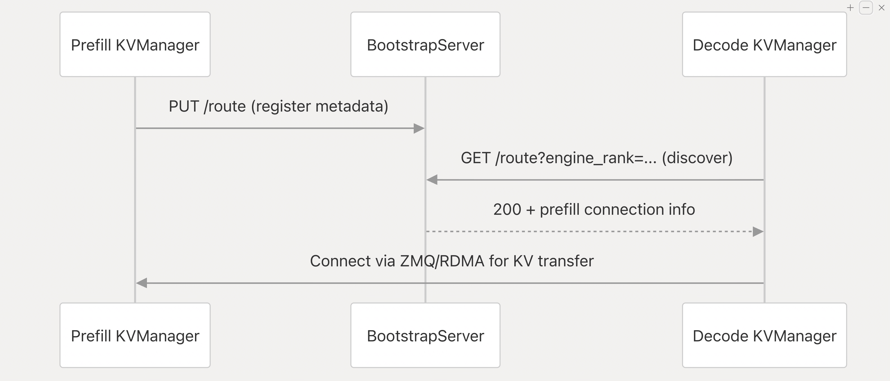

# PD Diss

1. Clone Specific Release 

```bash
git clone https://github.com/sgl-project/sglang.git

# Move into the directory
cd sglang

# Checkout the specific version
git checkout v0.5.7
```

2. Install Dependencies

```bash
pip install --upgrade pip
pip install -e "python"
sudo apt update
sudo apt install -y libnuma-dev
sudo apt install -y libnuma1
sudo apt install -y build-essential g++ pkg-config
sudo apt install -y libstdc++-13-dev
sudo apt install nvidia-cuda-toolkit
conda install -y -c conda-forge cmake
```


3. Conda setup

```bash
source "$HOME/Udbhav/miniconda3/etc/profile.d/conda.sh"
conda activate src_com
```

4. Server Start
```bash
 python3 -m sglang.launch_server --config config.yaml > sglang.log 2>&1 
```

3. Testing Command 
```bash
curl "http://127.0.0.1:30000/generate" \
  -H "Content-Type: application/json" \
  -d '{
    "text": "Hello, my name is",
    "sampling_params": {"max_new_tokens": 16, "temperature": 0}
  }'
```

3. Using HiCacheFile as backend
Using HiCacheFiles to test for persistence of KV cache across runs, 
    1. Write Policy : `write-through`
    2. mem-fraction-static: 0.2 // to force the cache out of the GPU memory
    3. hicache-ratio: 1
```bash
export SGLANG_HICACHE_FILE_BACKEND_STORAGE_DIR="$HOME/Udbhav/source_compile/hicache_persistence"
```

4. 
```bash
Clear the JIT compilation cacheexport SGLANG_DEBUG=1
rm -rf /root/.cache/tvm-ffi/
```

## Tracing the Disk Reload issue?

1. `hicache_storage.py` -> Creates the Hicache controller and loads the cache
2. `hiradix_cache.py` -> 
    ```bash
    func -> prefetch_from_storage is responsible but not running due to conditions not met
    HELLOOOO WORLD FROM PREFETCH 
Prefetching tokens: 7
True
256
Cannot prefetch due to conditions not met

    6. This file runs and calls the functions successfully but

`cache_controller.py`
    ```bash
    [2026-02-05 07:24:35] Revoking prefetch for request dac9f11344814e66b041fa58ce4449fc due to insufficient hits (0).
[2026-02-05 07:24:35] Prefetch dac9f11344814e66b041fa58ce4449fc completed with 0 tokens
    ```

7. Flow 
When a request arrives after restart:

1. `prefetch_from_storage()` is called
2. `HiCacheController.prefetch()` queues the operation `cache_controller.py:761-777`
3. `prefetch_thread_func()` calls `_storage_hit_query()` which returns 0 hits `cache_controller.py:910-959`
  1. `_storage_hit_query`   -> Get no prefix_key # THIS IS THE ISSUE
4. Since 0 < prefetch_threshold (256), prefetch is revoked `cache_controller.py:936-943`
5. System generates new cache and tries to write it, triggering "already exists" messages `hicache_storage.py:249-251`


## Fix
Fixed this to accumulate the Prefix keys
```bash
prefix_keys = list(operation.prefix_keys) if operation.prefix_keys is not None else []
```

Now 
```bash
Aligned prefetch length: 25153
Sending prefetch operation d11d27318479422ca27c3f194df1eb4a with 25153 tokens.
Sending prefetch keys: ['a7d933a1375c236bbd43f144ddca8e85e17bc7f4eeacbb6dcbbccc1ea5ed3eba']
Sending Operation to prefetch buffer <sglang.srt.managers.cache_controller.PrefetchOperation object at 0x76d43ed18550>
Entered _storage_hit_query
Recieved Operation <sglang.srt.managers.cache_controller.PrefetchOperation object at 0x76d43ed18550>
Recieved Tokens to Fetch 25153
Prefix Keys Original ['a7d933a1375c236bbd43f144ddca8e85e17bc7f4eeacbb6dcbbccc1ea5ed3eba']
File : /home/ubuntu/Udbhav/v0.5.7/sglang/python/sglang/srt/managers/cache_controller.py
Prefix Keys Fetched ['a7d933a1375c236bbd43f144ddca8e85e17bc7f4eeacbb6dcbbccc1ea5ed3eba']

[2026-02-05 09:19:07] Prefetch d11d27318479422ca27c3f194df1eb4a completed with 0 tokens
[2026-02-05 09:19:08] Prefetching 25153 pages for request d11d27318479422ca27c3f194df1eb4a.
```


## Docker Setup

1. Using the `docker-compose.yml`
2. 
```bash
# Install the nvidia-cuda-toolkit and other GPU packages and check the docker runtime to see if it is configured to use GPU
docker compose up -d
docker exec it udbhav_env bash

docker compose down --volumes --remove-orphans
docker compose build --no-cache
docker compose up -d


export PATH=/Udbhav/miniconda3/bin:$PATH
python3 decode.py --config decode.yaml > decode.log 2>&1 
python3 prefill.py  --config prefill.yaml > prefill.log 2>&1 
```

## Disaggregation 

1. `disaggregation-mode` : prefill, decode
2. `disaggregation-transfer-backend`: The disaggregation transfer backend moves KV cache data between prefill and decode instances in Prefill-Decode (PD) disaggregation. After a prefill instance processes a prompt, the backend transfers the generated KV cache to a decode instance for token generation. Supported backends include mooncake, nixl, ascend, and fake

> So basically Sglang doesn't support disaggregation natively -> it uses third party plugins to support the transfer backend

### Why fake works in decode but not prefill
1. In prefill mode, a bootstrap server must start to coordinate with decode instances . The fake backend does not provide a BOOTSTRAP_SERVER implementation; its class mapping only includes KVARGS, SENDER, and RECEIVER . Therefore get_kv_class(..., BOOTSTRAP_SERVER) returns None, causing the TypeError.
2. In decode mode, no bootstrap server is needed. The decode side only needs a receiver to fetch KV data from the prefill side. The fake backend provides a FakeKVReceiver . Additionally, decode can auto-enable fake mode when disaggregation_decode_enable_fake_auto is set or the request specifies a fake bootstrap host, directly using the FakeKVReceiver


### Imp Info
1. The bootstrap server is a lightweight HTTP service that runs only on the prefill side in Prefill-Decode disaggregation. It lets decode workers discover and connect to prefill workers by storing and serving metadata like IP/port and parallelism info. It uses a separate port (--disaggregation-bootstrap-port, default 8998) to isolate coordination traffic from data transfer and other services




## IMPORTANT PD DISSAGREGATION

1. The load_cpu_copy has torch.cuda.synchronize and this stops the execution on CPU only machine 
```bash
    def load_cpu_copy(self, kv_cache_cpu, indices):
        # torch.cuda.synchronize()
        chunk_size = self.cpu_offloading_chunk_size
        for layer_id in range(self.layer_num):
            for i in range(0, len(indices), chunk_size):
                chunk_indices = indices[i : i + chunk_size]
                k_cpu, v_cpu = (
                    kv_cache_cpu[layer_id][i // chunk_size][0],
                    kv_cache_cpu[layer_id][i // chunk_size][1],
                )
                assert k_cpu.shape[0] == v_cpu.shape[0] == len(chunk_indices)
                k_chunk = k_cpu.to(self.k_buffer[0].device, non_blocking=True)
                v_chunk = v_cpu.to(self.v_buffer[0].device, non_blocking=True)
                self.k_buffer[layer_id][chunk_indices] = k_chunk
                self.v_buffer[layer_id][chunk_indices] = v_chunk
        # torch.cuda.synchronize()
```
File location -> `/home/interns/Udbhav/sglang/python/sglang/srt/mem_cache/memory_pool.py`
